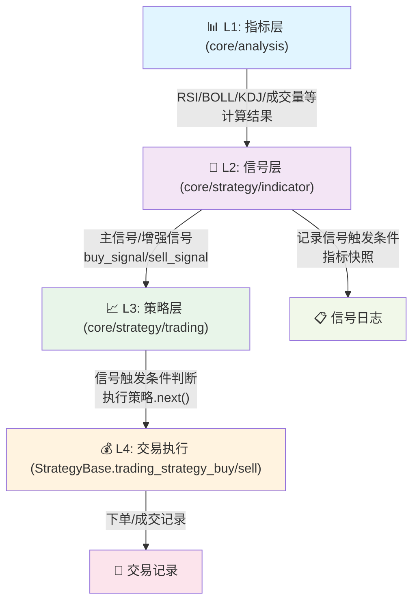
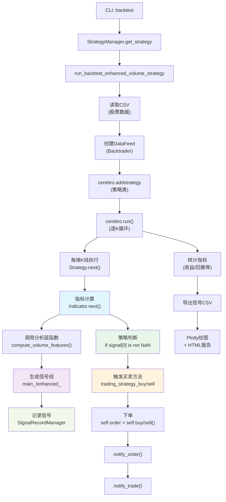

# 策略回测流程说明

**命令入口**
```
python -m core.cli backtest --csv data/stock/akshare/US.AAPL_AAPL_20211126_20251124.csv --strategy EnhancedVolumeStrategy
```

## 1. 整体架构：指标 → 信号 → 策略 → 交易

### 分层职责



**关键原则**：
- **指标层只计算**：不产生信号，输出数值与统计量
- **信号层只判断**：消费指标输出，根据规则生成买/卖信号
- **策略层只消费**：检查信号是否存在，调用买卖方法
- **交易层只执行**：处理资金、仓位、手续费、下单等

---

## 2. 回测流程全景



## 3. 关键代码节点映射

### 指标层（L1）：`core/analysis/indicators/`

位置：`core/analysis/indicators/volume.py` / `vcp.py`

职责：**向量化计算**指标数值，不含任何交易逻辑。

示例（成交量指标）：
```python
def compute_latest_volume_features(df, params):
    """计算当前K线的成交量特征值"""
    # 返回：{
    #   'vol_ma_5': 5日成交量均值,
    #   'vol_ma_20': 20日成交量均值,
    #   'close_ma_5': 5日收盘价均值,
    #   'rsi': RSI值,
    #   'boll_upper': 布林带上轨,
    #   'kdj_k': KDJ-K值,
    #   ...
    # }
```

---

### 信号层（L2）：`core/strategy/indicator/`

位置：`core/strategy/indicator/volume/enhanced_volume.py` / `single_volume.py`  
      `core/strategy/indicator/pattern/vcp_indicator.py`

职责：**消费指标输出**，根据规则产生**买卖信号线**。

核心流程（EnhancedVolumeIndicator.next()）：
```python
def next(self):
    # 1. 调用分析层计算指标
    vol_features = compute_latest_volume_features(df, params)
    
    # 2. 规则判断 - 主信号
    if vol_features['vol_ma_5'] > vol_features['vol_ma_20'] * 1.5:
        # 成交量放大，且均线满足方向判断 → 主买入信号
        self.lines.main_buy_signal[0] = self.data.close[0]
        self.signal_record_manager.add_signal_record(...)
    
    # 3. 规则判断 - 增强信号
    if (main_buy_signal and  
        vol_features['rsi'] < 30 and  # RSI超卖
        price < boll_lower and  # 价格在布林带下方
        kdj_k < 20):  # KDJ极端低位
        # 多重验证通过 → 增强买入信号
        self.lines.enhanced_buy_signal[0] = self.data.close[0]
```

输出信号线：
- `main_buy_signal` / `main_sell_signal`：基础信号
- `enhanced_buy_signal` / `enhanced_sell_signal`：过滤后信号
- `vcp_signal` / `vcp_sell_signal`：形态信号
- `vcp_plus_signal` / `vcp_plus_sell_signal`：VCPPlus 信号

---

### 策略层（L3）：`core/strategy/trading/`

位置：`core/strategy/trading/volume/enhanced_volume.py` / `single_volume.py`  
      `core/strategy/trading/pattern/vcp_strategy.py`

职责：**消费信号**，判断买卖条件，调用交易方法。

核心流程（EnhancedVolumeStrategy.next()）：
```python
def next(self):
    if self.order:  # 有未成交订单时等待
        return
    
    # 检查增强信号
    if not np.isnan(self.indicator.lines.enhanced_buy_signal[0]):
        logger.info(f'*** 增强买入信号 {self.data.close[0]} ***')
        self.trading_strategy_buy()  # 调用买入方法
        self.buy_signals_count += 1
    elif not np.isnan(self.indicator.lines.enhanced_sell_signal[0]):
        logger.info(f'*** 增强卖出信号 {self.data.close[0]} ***')
        self.trading_strategy_sell()  # 调用卖出方法
        self.sell_signals_count += 1
```

---

### 交易层（L4）：`core/strategy/trading/common.py`

位置：StrategyBase 类的 `trading_strategy_buy()` / `trading_strategy_sell()`

职责：**执行交易**，处理资金管理、仓位限制、手续费、下单。

核心流程：
```python
def trading_strategy_buy(self):
    # 1. 计算可用资金
    total_asset = self.broker.getvalue()  # 总资产
    available_cash = self.broker.getcash()  # 可用现金
    usable_cash = min(available_cash, 
                     total_asset * self.max_single_buy_percent,  # 单笔限额
                     total_asset * self.max_portfolio_percent)   # 投资组合限额
    
    # 2. 计算买入数量
    price = self.data.close[0]
    buy_size = (usable_cash // price) // self.min_order_size * self.min_order_size
    
    # 3. 下单
    if buy_size >= self.min_order_size:
        self.order = self.buy(size=buy_size, price=price)
        logger.info(f"【买入挂单】 股数={buy_size} 价格={price:.2f}")
```

Backtrader 自动调用 `notify_order()` 和 `notify_trade()` 更新持仓。

---

## 4. 五大策略的买卖原理与使用场景

### (1) EnhancedVolumeStrategy（增强量化）

**特点**：多指标综合过滤，信号较保守

**买入原理**：
```
成交量突破 + 价格突破 + RSI低位 + 布林带低位 + KDJ同向
```
- 成交量：短期均量 > 长期均量 × 1.5（成交量放大）
- 价格：短均线 > 收盘价（短期上升趋势）
- RSI：< 30 或刚穿越 30（超卖反弹）
- 布林带：价格接近下轨（极端压低）
- KDJ：K/D/J 都 < 20（同步低位）

**卖出原理**：
```
成交量萎缩 + 价格突破 + RSI高位 + 布林带高位 + KDJ同向
```
- 反向触发上述条件

**使用场景**：
- ✅ 波动性强、量能充足的品种（A股、美股高流动性）
- ✅ 日线及以上周期
- ✅ 风险偏低的投资者（信号少，但精准度较高）
- ❌ 低流动性品种（信号太稀疏）

**参数调优建议**：
- `boll_width`：增大 → 信号更保守；减小 → 信号更频繁
- RSI 极值阈值：可调 30 改为 25/35
- 成交量倍数：默认 1.5，可改为 1.3（更灵敏）或 1.8（更严格）

---

### (2) SingleVolumeStrategy（简单量化）

**特点**：仅使用主信号（成交量+均线），信号更频繁

**买入原理**：
```
成交量突破 + 价格方向确认 + 连续阴/阳线形态
```
- 成交量：短期均量 > 长期均量 × 阈值
- 均线方向：判断短/中/长期趋势
- 形态：连续 N 天同向K线（确认趋势）

**卖出原理**：
```
反向条件触发
```

**使用场景**：
- ✅ 快速交易、频繁调仓的策略
- ✅ 中期趋势跟踪（周线/日线）
- ✅ 量化对冲组合
- ❌ 高滑点/高手续费品种（交易次数多）

**vs EnhancedVolumeStrategy**：
- 交易次数：Single **2-3 倍**高于 Enhanced
- 信号精准：Enhanced **高于** Single（多重过滤）

---

### (3) VCPStrategy（波动收缩形态）

**特点**：形态识别，强趋势捕捉

**买入原理**：
```
Stage 2 + VCP 形态识别 + 进度评分
```

1. **Stage 2 趋势模板**（必须满足）：
   - 价格 > MA50 > MA150 > MA200（强上升趋势）
   - 收盘 > 开盘（多头确认）

2. **VCP 波动收缩**（识别底部结构）：
   - 高点递减，低点递增 → 形成"收缩"
   - 成交量逐次递减 → 量能枯竭
   - 连续 2-4 次收缩 → 积能阶段

3. **进度评分**（0-1，默认阈值 1.0）：
   - 形态完整度得分
   - 时间周期达成度
   - 满足 100% 才出信号

**卖出原理**：
```
EMA(5) 穿越检测 + 反向突破
```
- 价格从 EMA(5) 上方跌破下方 → 卖出信号

**使用场景**：
- ✅ 长周期强趋势捕捉（1-3 个月）
- ✅ 单边行情（涨/跌明确）
- ✅ 低频交易策略（信号稀疏但高胜率）
- ❌ 震荡盘（信号极少）
- ❌ 需要频繁调仓（出信号间隔长）

**参数调优建议**：
- `progress_threshold`：0.34（VCPStrategyLoose 用于验证）→ 1.0（严格）
- `min_contractions` / `max_contractions`：调整识别次数范围
- `ema_sell_period`：默认 5，可改为 20 以延迟卖出

---

### (4) VCPPlusStrategy（VCP 强化版）

**特点**：完整 VCP 筛选逻辑 + RS 评级过滤

**买入原理**：
```
Stage 2 趋势模板 + VCP 收缩 + 成交量枯竭 + 未突破 + RS 评级
```

1. **Stage 2 趋势模板**（原样保留）：
   - 价格 > MA50 > MA150 > MA200
   - MA200 斜率向上
   - 价格高于 52 周低点 30%，且处于 52 周高点 25% 内
   - RS 线斜率向上（需要基准收盘价列）

2. **VCP 收缩结构**：
   - 2-4 次收缩
   - 最大收缩不超过 50%，最小收缩不超过 15%
   - 收缩至少持续 2 周
   - 成交量枯竭：5 日均量 < 30 日均量
   - 未突破盘整区间

3. **RS 评级过滤**：
   - RS 评级 ≥ 70（由 CSV 预留字段提供）

**卖出原理**：
```
EMA(5) 跌破触发
```

**使用场景**：
- ✅ 严格选股与观察池筛选
- ✅ 与 Finviz 条件联动的 VCP 形态验证
- ❌ 缺少基准/RS 数据时（需补充 CSV 字段）

---

### (5) VCPStrategyLoose（VCP 宽松版，验证用）

**特点**：VCP 形态框架，降低触发门槛

**改动**：
- `progress_threshold = 0.34`（vs 严格版 1.0）
- 进度评分只需达 34% 即出信号

**使用场景**：
- 🔧 回测管线验证（确保流程通畅）
- 🔧 形态识别调试（参数敏感性测试）
- ❌ 实盘交易（信号过多，胜率下降）

---

## 5. 五大策略的对标与选择建议

| 指标 | Enhanced | Single | VCP | VCPPlus | VCP Loose |
|------|----------|--------|-----|---------|----------|
| **信号频率** | 低（保守过滤） | 中（基础规则） | 极低（形态稀有） | 极低（严格过滤） | 中（验证用） |
| **交易胜率** | 高 | 中 | 很高 | 很高 | 低（验证用） |
| **年交易次数** | 20-50 | 50-150 | 5-20 | 5-15 | 100+ |
| **适用周期** | 日/周 | 日 | 周/月 | 周/月 | 日 |
| **适用品种** | 流动性好 | 流动性中 | 波动强 | 强趋势 + RS | 全品种 |
| **技术难度** | 中等 | 简单 | 复杂 | 更复杂 | - |
| **参数敏感性** | 中 | 高 | 低 | 低 | 中 |

**选择逻辑**：
- 快速验证回测管线 → **VCPStrategyLoose**
- 稳定高胜率交易 → **EnhancedVolumeStrategy**
- 频繁短期跟踪 → **SingleVolumeStrategy**
- 长期强趋势捕捉 → **VCPStrategy**
- 严格 VCP + RS 过滤 → **VCPPlusStrategy**

---

## 6. 指标计算中的向量化与信号记录

### 6.1 向量化计算示例（Enhanced）

**错误**（循环，禁止）：
```python
for i in range(len(df)):
    df.at[i, 'rsi'] = compute_rsi(df.iloc[:i])  # ❌ 逐行计算，极其缓慢
```

**正确**（向量化）：
```python
# 利用 Backtrader 内置 RSI 或 pandas rolling
rsi = bt.indicators.RSI(self.data.close, period=14)  # Backtrader 向量化
# 或：
df['rsi'] = df['close'].rolling(14).apply(lambda x: talib.RSI(x, 14)[-1], raw=True)
```

### 6.2 信号记录机制

每条信号触发时记录到 `SignalRecordManager`：

```python
self.signal_record_manager.add_signal_record(
    date=self.data.datetime.date(),
    signal_type='enhanced_buy',  # 标准化类型
    signal_description=f'成交量: {vol_ma_5:.0f}手 > {vol_ma_20:.0f}手, RSI: {rsi:.1f}, 价格: {price:.2f}'
)
```

导出为 CSV 与 Neon 数据库（便于复盘与数据分析）。

---

## 7. HTML 报告中的信号展示

### 7.1 信号样式配置

位置：`core/visualization/visual_tools_plotly.py` → `SIGNAL_STYLE_CONFIG`

通过统一配置支持多种信号类型可视化：

```python
SIGNAL_STYLE_CONFIG = [
    {
        "signal_type": "enhanced_buy",      # 信号类型标识
        "name": "增强买入信号",              # 图例名称
        "text": "增",                       # 图上显示文字
        "symbol": "circle",                # 标记形状
        "color": "#2f6b4f",                # 标记颜色
        "text_color": "#2f6b4f",           # 文字颜色
        "y_offset": 0.95,                  # 相对K线低点的位置
    },
    # ... 其他信号类型
    {
        "signal_type": "vcp_buy",
        "name": "VCP 买入信号",
        "text": "VCP",
        "symbol": "diamond",
        "color": "#f59e0b",
        "y_offset": 0.93,
    },
    {
        "signal_type": "vcp_plus_buy",
        "name": "VCPPlus 买入信号",
        "text": "VCP+",
        "symbol": "diamond",
        "color": "#0f766e",
        "y_offset": 0.93,
    },
]
```

### 7.2 信号类型标准化

函数：`core/strategy/indicator/common.py` → `normalize_signal_type()`

```python
def normalize_signal_type(signal_type: str) -> str:
    """
    将来自不同指标的信号类型转换为标准名称
    例如：'enhanced_buy' → 统一显示配置
    """
    return signal_type  # 当前返回原值，可扩展转换逻辑
```

### 7.3 HTML 报告渲染流程

1. **提取信号数据**：从策略指标的 `SignalRecordManager` 获取信号记录
2. **过滤有效日期**：确保信号日期在 CSV 数据范围内
3. **按配置渲染**：遍历 `SIGNAL_STYLE_CONFIG`，为每种信号类型添加 Plotly 标记点
4. **生成悬浮信息**：hover 时显示信号触发条件与指标值（后续 Neon 扩展）

示例（Plotly scatter 标记）：
```python
fig.add_trace(
    go.Scatter(
        x=signal_dates,
        y=signal_prices,
        mode='markers+text',
        name='增强买入信号',
        marker=dict(symbol='circle', color='#2f6b4f', size=10),
        text=['增' for _ in range(len(signal_dates))],
        hovertemplate='日期: %{x}<br>信号: %{customdata[0]}<extra></extra>',
        customdata=signal_descriptions,
    )
)
```

---

## 8. 运行示例与验证

### 8.1 执行回测

```bash
# Enhanced 策略
python -m core.cli backtest \
  --csv data/stock/akshare/US.AAPL_AAPL_20211126_20251124.csv \
  --strategy EnhancedVolumeStrategy

# VCP 策略
python -m core.cli backtest \
  --csv data/stock/akshare/US.AAPL_AAPL_20211126_20251124.csv \
  --strategy VCPStrategy

# VCPPlus 策略
python -m core.cli backtest \
  --csv data/stock/akshare/US.AAPL_AAPL_20211126_20251124.csv \
  --strategy VCPPlusStrategy

# VCP 宽松版（验证用）
python -m core.cli backtest \
  --csv data/stock/akshare/US.AAPL_AAPL_20211126_20251124.csv \
  --strategy VCPStrategyLoose
```

### 8.2 输出文件

回测完成后，生成以下文件：

```
html/
├── US.AAPL_20251124_backtest_report.html    # 回测结果报告
└── ...

signals/
└── data/
    └── US.AAPL_20251124_enhanced_volume_signals.csv  # 信号详情 CSV
```

### 8.3 预期结果

打开 HTML 文件，观察：
- ✅ K线图表显示
- ✅ 信号点标记（绿色圆/红色圆/橙色菱形等）
- ✅ 悬停信号点显示触发条件描述
- ✅ KPI 卡片展示收益率/回撤/交易次数

---

## 9. 扩展：Neon 信号数据库落库

未来计划（见 `docs/neon-signal-backtest-html-plan.md`）：

每次产生信号时，除了记录 CSV 外，还会同步写入 Neon 数据库，存储：
- 信号触发时的指标快照（RSI/BOLL/成交量等数值）
- 触发条件描述（便于复盘"为什么出这个信号"）
- 回测元信息（run_id / 策略名 / 股票代码等）

HTML 报告可通过后端 API 查询 Neon，在悬浮面板展示完整指标值。

---

## 10. 开发指南：新增策略

### 10.1 三层框架

创建新策略时，需要按分层实现：

```
1️⃣ 指标层（可选，如已有分析函数则复用）
   core/analysis/indicators/my_indicator.py
   ├─ 向量化计算函数
   └─ 输出结构化指标值（DataFrame / dict）

2️⃣ 信号层（必须）
   core/strategy/indicator/{category}/my_indicator.py
   ├─ class MyIndicator(bt.Indicator)
   ├─ 消费指标值，根据规则生成买卖信号线
   └─ 记录信号到 SignalRecordManager

3️⃣ 策略层（必须）
   core/strategy/trading/{category}/my_strategy.py
   ├─ class MyStrategy(StrategyBase)
   ├─ 检查信号是否存在
   └─ 调用 trading_strategy_buy/sell()

4️⃣ 交易层（自动）
   StrategyBase 提供
   ├─ trading_strategy_buy/sell() 实现
   └─ notify_order/trade() 更新持仓
```

### 10.2 关键要点

- **严禁在信号层重复计算指标**：应调用 `core/analysis` 函数
- **严禁在策略层添加买卖逻辑**：只做 `if signal exists` 的判断
- **记录每条信号**：便于回测复盘与数据分析
- **继承 StrategyBase**：获得统一的资金管理与记录接口

### 10.3 自动发现机制

新增策略会自动被 `StrategyManager` 发现：

```bash
python -m core.cli strategy list
# 输出：EnhancedVolumeStrategy, SingleVolumeStrategy, VCPStrategy, VCPPlusStrategy, ...
```

（无需手动注册，基于 walk_packages 自动扫描）

---

## 总结

本文档说明了从 **指标层 → 信号层 → 策略层 → 交易层** 的清晰分层架构：

| 层级 | 职责 | 关键文件 | 核心方法 |
|------|------|---------|---------|
| **L1 指标** | 向量化计算 | `core/analysis/indicators/` | `compute_*_features()` |
| **L2 信号** | 规则判断，产生信号 | `core/strategy/indicator/` | `Indicator.next()` |
| **L3 策略** | 消费信号，执行买卖 | `core/strategy/trading/` | `Strategy.next()` |
| **L4 交易** | 资金/仓位管理，下单 | `core/strategy/trading/common.py` | `trading_strategy_buy/sell()` |

五大策略（Enhanced、Single、VCP、VCPPlus、VCPLoose）各有特色，根据交易目标与品种特性选择即可。
